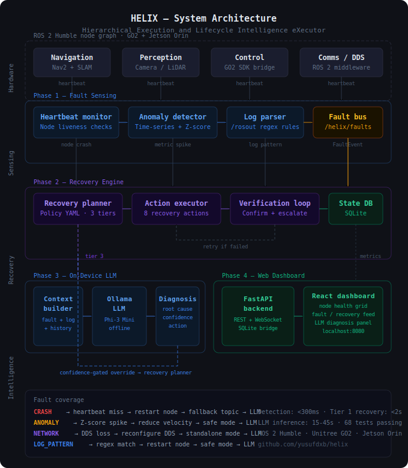

# HELIX — Structured Fault Sensing for ROS 2 Systems

> A fault observability prototype: three lifecycle-managed detection nodes, a custom fault message type, and offline benchmarks.

[](https://github.com/yusufdxb/helix/actions/workflows/ci.yml)
[](https://docs.ros.org/en/humble/)
[](https://python.org)
[](LICENSE)

---

## What This Is

HELIX is a bounded ROS 2 fault sensing prototype. It implements three lifecycle nodes that monitor a ROS 2 graph and publish structured `FaultEvent` messages when problems are detected:

- **Heartbeat monitor** — timeout-based liveness checks on expected nodes
- **Anomaly detector** — rolling Z-score over numeric metric streams
- **Log parser** — regex rule matching against log patterns

All three nodes publish to `/helix/faults` using a custom `FaultEvent.msg` type. A fault injector node is included for local demonstration and testing.

Offline benchmarks (pure-Python ports of the detection logic) are provided for evaluating algorithmic performance without a ROS 2 runtime.

## What This Is Not

This repository does **not** contain:

- A recovery or self-healing engine
- LLM-based diagnosis
- A web dashboard or operator UI
- Persistent event storage
- Hardware deployment artifacts or robot-specific code (though hardware evaluation has been conducted — see `docs/GO2_HARDWARE_EVIDENCE.md`)

A `RecoveryHint.msg` is defined in `helix_msgs` but is not used by any node in this codebase.

## Architecture Overview

<p align="center">
  
</p>

```text
monitored ROS 2 graph
        |
        +--> /diagnostics -------------------+
        |                                    |
        +--> /helix/metrics -----------------+--> helix_core
        |                                    |    - heartbeat_monitor
        +--> log stream / fault rules -------+    - anomaly_detector
                                                  - log_parser
                                                  |
                                                  +--> /helix/faults (FaultEvent)
```

More detail: [ARCHITECTURE.md](ARCHITECTURE.md)

## Packages

| Package | Contents |
|---|---|
| `helix_msgs` | `FaultEvent.msg`, `RecoveryHint.msg` (defined but unused) |
| `helix_core` | `anomaly_detector.py`, `heartbeat_monitor.py`, `log_parser.py` (lifecycle nodes) |
| `helix_adapter` | `topic_rate_monitor.py`, `json_state_parser.py`, `pose_drift_monitor.py` (lifecycle nodes that bridge non-standard robot topics into `/helix/metrics`) |
| `helix_bringup` | Launch files (`helix_sensing.launch.py`, `helix_adapter.launch.py`), YAML config, `fault_injector.py` |

## Quick Start

### Build

```bash
mkdir -p ~/helix_ws/src
cd ~/helix_ws/src
git clone https://github.com/yusufdxb/helix.git
cd ~/helix_ws
source /opt/ros/humble/setup.bash
colcon build --symlink-install --packages-select \
    helix_msgs helix_core helix_adapter helix_bringup
source install/setup.bash
```

### Launch the sensing stack

```bash
ros2 launch helix_bringup helix_sensing.launch.py
```

The launch auto-transitions all three lifecycle nodes through `configure → active`. Verify in another terminal:

```bash
ros2 lifecycle get /helix_heartbeat_monitor   # -> active
ros2 lifecycle get /helix_anomaly_detector    # -> active
ros2 lifecycle get /helix_log_parser          # -> active
ros2 topic echo /helix/faults                 # listens for FaultEvents
```

If you want to drive the lifecycle yourself, pass `auto_activate:=false` and use `ros2 lifecycle set` per node.

### Launch the GO2 adapter stack (optional — for non-standard robot topics)

```bash
ros2 launch helix_bringup helix_adapter.launch.py
# add sim_mode:=true to remap /utlidar/cloud -> /utlidar/cloud_throttled
```

The adapter publishes `/helix/metrics` from configured GO2 rate / JSON-state / pose-drift sources so the `helix_core` AnomalyDetector can run against a real robot that does not natively publish HELIX-shaped inputs.

### Inject faults (separate terminal)

```bash
ros2 run helix_bringup helix_fault_injector
```

### Run benchmarks (no ROS required)

```bash
python3 benchmark_helix.py
```

## Evaluation

Five benchmark suites evaluate the sensing components:

| Benchmark | Key Result | ROS 2? |
|-----------|-----------|--------|
| Algorithmic throughput | ~81K samples/sec (PC i7-7700), ~64K (Jetson Orin NX) | No |
| End-to-end ROS 2 latency | 1.16 ms mean (p95: 1.24 ms) | Yes |
| Realistic anomaly detection | 96.5% TPR at Z=3.0 with marginal anomalies; 0% TPR for 3-sigma in Laplace noise | No |
| Log parser accuracy | 22/22 correct, ~248K msg/sec throughput | No |
| GO2 attachability | 1/4 HELIX inputs reliably native (`/rosout`); 54 topics adaptable | No |
| Adapter-based detection | 4 real FaultEvents from live GO2 LiDAR rate anomaly (Session 1, archived `passive_adapter.py`); reproduced in Session 2 | Yes |
| Persistent Jetson deployment | 30-min run, 0 OOM / 0 thermal throttle / 0 lifecycle deaths (Session 5) | Yes |

Full results, methodology, and caveats: [RESULTS.md](RESULTS.md)

## Testing

Unit tests exercise the three `helix_core` nodes via `rclpy` in isolation. ROS 2 Humble is required.

```bash
cd ~/helix_ws
source /opt/ros/humble/setup.bash
colcon test --packages-select helix_core
colcon test-result --verbose
```

Full details: [TESTING.md](TESTING.md)

## Artifact Scope

An evaluator can reproduce the following from a clean clone of the main branch:

1. **Build** — `colcon build --symlink-install --packages-select helix_msgs helix_core helix_adapter helix_bringup` in a ROS 2 Humble environment
2. **Unit tests** — `colcon test --packages-select helix_core helix_adapter` (requires ROS 2 Humble); root-level repo-integrity tests via `python3 -m pytest tests/ -v` (no ROS 2 required)
3. **Standalone benchmarks** — `python3 benchmark_helix.py`, `python3 scripts/bench_realistic_anomalies.py`, `python3 scripts/bench_log_parser.py` (no ROS 2 required)
4. **End-to-end latency** — `python3 scripts/bench_e2e_latency.py` (requires ROS 2 Humble + built workspace)
5. **GO2 gap analysis** — `python3 scripts/go2_topic_gap_analysis.py` (no ROS 2 required)
6. **Live demo** — `ros2 launch helix_bringup helix_sensing.launch.py` (auto-activates) and `ros2 run helix_bringup helix_fault_injector` in another terminal
7. **Adapter overhead measurement** — `python3 scripts/measure_helix_overhead.py --with-adapter --duration 30` (requires ROS 2 Humble + built workspace; instantiates all 6 lifecycle nodes in-process and writes `results/helix_overhead_with_adapter_live.json`. Refuses to run if `ros2 launch helix_bringup helix_sensing.launch.py` or `helix_adapter.launch.py` is already active — stop the launched stack first to avoid name collisions)

Steps 1, 2 (the `colcon test` half), 4, 6, and 7 require ROS 2 Humble. The `ros:humble-ros-base` Docker image is a known-good environment. Steps 3 and 5 (and the `pytest tests/` half of step 2) run with standard Python 3.10+. All in-repo result artifacts are stored in `results/`. Hardware-evaluation bag artifacts referenced from `docs/GO2_HARDWARE_EVIDENCE.md` live on the T7 evidence drive (`hardware_eval_20260403/`, `hardware_eval_20260406/`, `hardware_eval_20260415/`) and are not shipped on the main branch — main-branch reproducibility ends at the algorithms, the lifecycle nodes, and the documented launch paths.

## Research Context

HELIX is designed with the Unitree GO2 quadruped and NVIDIA Jetson Orin NX as a target deployment platform. The sensing logic is platform-independent and has been validated through offline benchmarks and four bounded hardware sessions on the live GO2.

Hardware evaluation demonstrated:
- HELIX ROS 2 nodes running on the PC while observing the live GO2 ROS 2 graph (Sessions 1 / 2)
- A passive adapter bridging GO2 standard topics to HELIX's `/helix/metrics` input (Sessions 1 / 2 used the now-archived monolithic `passive_adapter.py`; the canonical main-branch path is the `helix_adapter` package)
- Real FaultEvent detection from a LiDAR rate anomaly on the GO2 via the adapter (Session 1: 4 events; Session 2: 2 events from a `/utlidar/robot_pose` rate anomaly, peak Z-score 4.41)
- Algorithmic benchmarks running on the Jetson Orin NX (64K samples/sec, 636x operational headroom)
- Cross-device DDS latency of 0.81 ms (one-way) between PC and Jetson
- Three `helix_core` lifecycle nodes running natively on the Jetson against the live GO2 for 1780 s with no OOM, no thermal throttle, and no lifecycle deaths (Session 5, 2026-04-15)
- End-to-end `/rosout` log-pattern detection with ~1.8 s detection latency under a controlled injection (Session 5)

HELIX has **not** been deployed as a persistent monitoring system on the GO2 — the longest run is 30 minutes — and three Session 5 physical injections (LiDAR cover, USB mic disconnect, unrelated topic flood) produced 0 FaultEvents because no adapter was configured to bridge those signals. The `/diagnostics` availability sighting from Session 1 was not reproduced in Sessions 2 or 5; treat native HELIX-input coverage on the GO2 as 1/4 (`/rosout` only). See `docs/GO2_HARDWARE_EVIDENCE.md` for full evidence, scope, and limitations.

## Author

**Yusuf Guenena**
M.S. Robotics Engineering — Wayne State University
[linkedin.com/in/yusuf-guenena](https://linkedin.com/in/yusuf-guenena) · [github.com/yusufdxb](https://github.com/yusufdxb)
