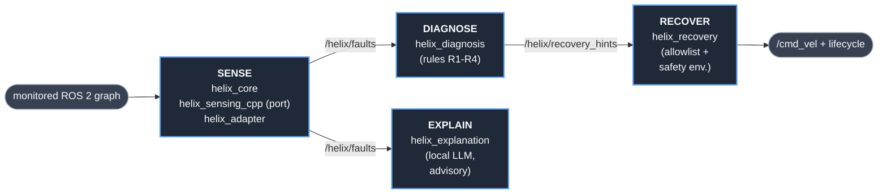

# HELIX — Self-Healing Middleware for ROS 2 Robots

> A closed-loop self-healing system for ROS 2: detect faults, diagnose root cause, recover safely, explain what happened. Validated on a Unitree GO2 + Jetson Orin NX.

[](https://github.com/yusufdxb/helix/actions/workflows/ci.yml)
[](https://docs.ros.org/en/humble/)
[](https://en.cppreference.com/w/cpp/17)
[](https://python.org)
[](LICENSE)

---

## Status

| Tier | State | Validation |
|---|---|---|
| **Sense** (`helix_core`, `helix_adapter`) | stable | Hardware-validated — 8 GO2 + Jetson lab sessions (2026-04-03 → 2026-04-23) |
| **Sense — C++ port** (`helix_sensing_cpp`) | work-in-progress | 30-min hardware parity run done (2026-04-23): -56% RSS, -60% CPU vs Python, but 44% RSS missed the 30% design-doc target. Remains launch-gated (`use_cpp_anomaly=false`). |
| **Diagnose** (`helix_diagnosis`) | work-in-progress | 16/16 unit tests green on Jetson (live-schema fixtures); closed-loop validated on live GO2 in Session 8 *after* R1 schema fix (branch `fix/r1-anomaly-schema-mismatch`, not yet on `main`). |
| **Recover** (`helix_recovery`) | work-in-progress | Hardware-validated end-to-end in Session 8: 14 hints consumed, allowlist + cooldown audited. Caveat: `/helix/cmd_vel` has 0 downstream subscribers — STOP_AND_HOLD is currently a void publish (not yet wired to twist_mux fallback). |
| **Explain** (`helix_explanation`) | work-in-progress | 26 unit tests green; ships `llm_enabled=false`; Jetson llama-server deployment pending |

Last stable release without the closed-loop stack: [`v0.2.1`](https://github.com/yusufdxb/helix/releases/tag/v0.2.1). Current self-healing work is tagged [`v0.3.0-wip-self-healing`](https://github.com/yusufdxb/helix/releases/tag/v0.3.0-wip-self-healing).

---

## What This Is

HELIX is a four-tier self-healing stack for ROS 2 robots:

1. **Sense** — lifecycle nodes monitor the ROS 2 graph and emit structured `FaultEvent` messages
   - Anomaly detector (rolling Z-score, Python + **C++ port**)
   - Heartbeat monitor (topic-rate liveness)
   - Log parser (regex rule matching)
   - Adapter nodes bridging robot-specific telemetry to `/helix/metrics`
2. **Diagnose** — a lifecycle node runs deterministic rules (R1–R4) against fault streams + context snapshots and publishes `RecoveryHint` suggestions. Pure-function rules are unit-testable without ROS 2.
3. **Recover** — a lifecycle node consumes hints, enforces a strict safety envelope (cooldown, allowlist `{STOP_AND_HOLD, RESUME, LOG_ONLY}`, enable flag), and is the only publisher of `cmd_vel`.
4. **Explain** — an advisory **local LLM** (llama-server sidecar, Qwen2.5-1.5B-Instruct Q4_K_M on Jetson) annotates events for operators. Runs with schema-constrained JSON decoding. **Never on the safety-critical path** — the Recover tier's allowlist is the hard gate.

Hot-path sensing nodes are being ported from Python to C++ so HELIX can coexist on the Jetson with the robot's Nav2 + perception stack without RAM or CPU pressure. See [`docs/CPP_PORT_DESIGN_ANOMALY_DETECTOR.md`](docs/CPP_PORT_DESIGN_ANOMALY_DETECTOR.md).

Offline benchmarks (pure-Python ports of the detection logic) are provided for evaluating algorithmic performance without a ROS 2 runtime.

## Architecture Overview

<p align="center">
  
</p>



More detail: [ARCHITECTURE.md](ARCHITECTURE.md)

## Packages

| Package | Language | Role | Contents |
|---|---|---|---|
| `helix_msgs` | msg | msgs | `FaultEvent`, `RecoveryHint`, `RecoveryAction`, `GetContext` srv |
| `helix_core` | Python | Sense | `anomaly_detector`, `heartbeat_monitor`, `log_parser` (reference implementation) |
| `helix_sensing_cpp` | C++ | Sense | C++ port of `anomaly_detector` (RollingStats kernel + LifecycleNode component). Launch-gated, Python stays default until hardware parity re-confirmed. |
| `helix_adapter` | Python | Sense | Lifecycle nodes bridging robot-specific telemetry (topic-rate monitor, JSON state parser, pose drift) to `/helix/metrics` |
| `helix_diagnosis` | Python | Diagnose | `context_buffer`, `diagnosis_node` (IDLE ↔ STOP_AND_HOLD state machine), pure-function `rules` |
| `helix_recovery` | Python | Recover | `recovery_node` with `SafetyEnvelope` (enable/cooldown/allowlist). Only publisher of `cmd_vel`. |
| `helix_explanation` | Python | Explain | `llm_explainer` + `llm_client` — llama-server sidecar client, `response_format: json_schema`, ThreadPoolExecutor, deterministic fallback. Advisory only. |
| `helix_bringup` | Python | Ops | Launch files, YAML config, `fault_injector` |

## Quick Start

### Build

```bash
mkdir -p ~/helix_ws/src
cd ~/helix_ws/src
git clone https://github.com/yusufdxb/helix.git
cd ~/helix_ws
source /opt/ros/humble/setup.bash
colcon build --symlink-install
source install/setup.bash
```

### Launch the sensing stack

```bash
ros2 launch helix_bringup helix_sensing.launch.py
```

### Inject faults (separate terminal)

```bash
ros2 run helix_bringup fault_injector
```

### Run benchmarks (no ROS required)

```bash
python3 benchmark_helix.py
```

## Evaluation

Five benchmark suites evaluate the sensing components:

| Benchmark | Key Result | ROS 2? |
|-----------|-----------|--------|
| Algorithmic throughput | ~81K samples/sec (PC i7-7700), ~64K (Jetson Orin NX) | No |
| End-to-end ROS 2 latency | 1.16 ms mean (p95: 1.24 ms) | Yes |
| Realistic anomaly detection | 96.5% TPR at Z=3.0 with marginal anomalies; 0% TPR for 3-sigma in Laplace noise | No |
| Log parser accuracy | 22/22 correct, ~248K msg/sec throughput | No |
| GO2 attachability | 2/4 HELIX inputs natively available; 54 topics adaptable | No |
| Adapter-based detection | 4 real FaultEvents from live GO2 LiDAR rate anomaly | Yes |

Full results, methodology, and caveats: [RESULTS.md](RESULTS.md)

## Testing

Unit tests exercise the three `helix_core` nodes via `rclpy` in isolation. ROS 2 Humble is required.

```bash
cd ~/helix_ws
source /opt/ros/humble/setup.bash
colcon test --packages-select helix_core
colcon test-result --verbose
```

Full details: [TESTING.md](TESTING.md)

## Artifact Scope

An evaluator can reproduce the following locally:

1. **Build** — `colcon build` in a ROS 2 Humble environment
2. **Unit tests** — `colcon test --packages-select helix_core` (requires ROS 2 Humble)
3. **Standalone benchmarks** — `python3 benchmark_helix.py`, `python3 scripts/bench_realistic_anomalies.py`, `python3 scripts/bench_log_parser.py` (no ROS 2 required)
4. **End-to-end latency** — `python3 scripts/bench_e2e_latency.py` (requires ROS 2 Humble + built workspace)
5. **GO2 gap analysis** — `python3 scripts/go2_topic_gap_analysis.py` (no ROS 2 required)
6. **Live demo** — launch the sensing stack and inject faults in simulation

Steps 1, 2, 4, and 6 require ROS 2 Humble. The `ros:humble-ros-base` Docker image is a known-good environment. Steps 3 and 5 run with standard Python 3.10+. All result artifacts are stored in `results/`.

**Reproducibility note (closed-loop demo).** The Session 8 closed-loop demonstration (SENSE → DIAGNOSE → RECOVER on live GO2) requires the R1 schema fix on branch `fix/r1-anomaly-schema-mismatch @ e821b47`. `main` does not yet contain this fix; reproducing the demo from `main` will produce 0 recovery hints because R1 silently fails to match live ANOMALYs. See `hardware_eval_20260423/results/closed_loop_demo.md`.

## Project Direction

HELIX is being shipped as a **public repo + demo video**. The deliverable is a working self-healing system that other roboticists can install and adapt. Four pillars:

1. **Closed-loop self-healing** — detect → diagnose → recover → explain, on GO2 + Jetson.
2. **C/C++ on hot paths** — Python is a RAM/latency liability on Jetson at steady-state. Hot-path sensing nodes are being ported to C++ (AnomalyDetector landed; HeartbeatMonitor, LogParser, adapter rate-monitor to follow). Target: <30% of Python RSS baseline.
3. **Local LLM for heal / flag / predict** — Qwen2.5-1.5B-Instruct Q4_K_M via llama-server sidecar on Jetson Orin NX (~1.5-1.7 GB RSS). Schema-constrained JSON output. Advisory only; never a control input.
4. **Hardware-validated** — eight lab sessions on a live GO2 as of 2026-04-23 (see below).

See [`docs/LLAMA_SERVER_JETSON_SETUP.md`](docs/LLAMA_SERVER_JETSON_SETUP.md) for the Jetson deployment runbook and [`docs/CPP_PORT_DESIGN_ANOMALY_DETECTOR.md`](docs/CPP_PORT_DESIGN_ANOMALY_DETECTOR.md) for the C++ port design.

## Research Context

Target platform: Unitree GO2 quadruped + NVIDIA Jetson Orin NX 16 GB. The sensing and recovery logic is platform-independent; adapter nodes isolate robot-specific telemetry.

Hardware validation across eight lab sessions (2026-04-03 → 2026-04-23) demonstrated:
- HELIX lifecycle nodes running persistently on the Jetson alongside the live GO2 stack
- 30-minute persistent deployment with all success criteria green (Session 5)
- 1-hour stability run with RSS plateau, refuting earlier leak concerns (Session 7)
- IMU-excluded overhead: 6-node sum 47.6% → 5.86% core CPU (-88%)
- Real FaultEvent detection from LiDAR rate anomalies on the GO2 via the adapter
- Ground-truth fault injection with ~1.8 s end-to-end detection latency
- Algorithmic benchmarks on Jetson Orin NX (62-64K samples/sec)
- Session 8 (2026-04-23): end-to-end closed-loop on live GO2 — 30 faults → 14 recovery hints (R1 STOP_AND_HOLD + R2 RESUME) → 14 audited actions (allowlist + cooldown); 30-min C++ anomaly-detector parity run at -56% RSS / -60% CPU vs Python (RSS missed 30% design target at 44%). Closed-loop required an R1 schema fix on a feature branch — see Reproducibility note above.

See `docs/GO2_HARDWARE_EVIDENCE.md` for full evidence, scope, and limitations.

## Author

**Yusuf Guenena**
M.S. Robotics Engineering — Wayne State University
[linkedin.com/in/yusuf-guenena](https://linkedin.com/in/yusuf-guenena) · [github.com/yusufdxb](https://github.com/yusufdxb)
