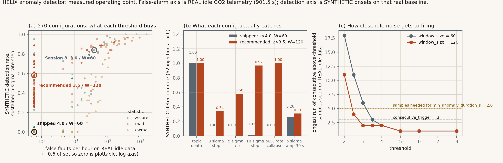
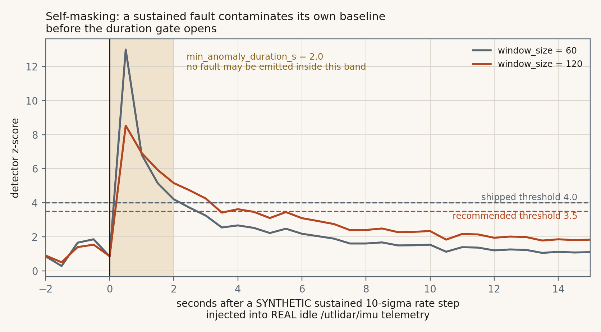
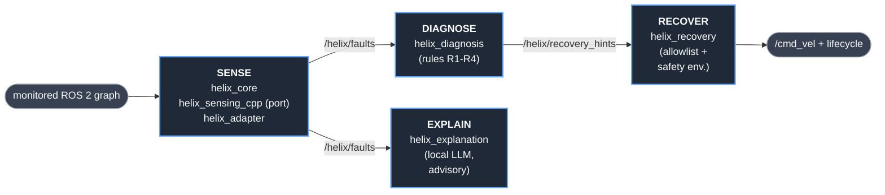

# HELIX

> A recovery plane for ROS 2 robots: detect a fault, decide what to do about it,
> gate the actuation that follows. Validated across eight bounded hardware
> sessions on a live Unitree GO2 with a Jetson Orin NX companion computer.

<p align="center">
  <a href="https://youtu.be/PbKXB91-NSY">
    
  </a>
</p>

[](https://github.com/yusufdxb/helix/actions/workflows/ci.yml)
[](https://docs.ros.org/en/humble/)
[](https://en.cppreference.com/w/cpp/17)
[](https://python.org)
[](LICENSE)

---

## What this is

Most ROS 2 stacks have no single place that owns "a fault happened, now what."
Diagnostics get reported, watchdogs catch dead nodes, navigation has its own
recovery behaviors, and a mux arbitrates whose `/cmd_vel` wins, but nothing
closes the loop from detection through a policy decision to a gated actuation
as one system with one safety envelope. HELIX is that loop: four ROS 2
lifecycle tiers, SENSE to CONTEXT to DIAGNOSE to RECOVER, where RECOVER is the
only publisher of `/helix/cmd_vel` and is gated by an enable flag, a 5 s
per-fault cooldown, and an action allowlist. It has been run end to end on a
live GO2 across eight lab sessions, most recently a 439 s idle run that
produced 30 detected faults, 14 recovery hints, 14 audited recovery actions,
and 3,064 zero-twist commands. [`docs/POSITIONING.md`](docs/POSITIONING.md) is
the honest version of this paragraph: it compares HELIX against
`diagnostic_updater`, `software_watchdogs`, `system_modes`, Nav2 recovery, and
`twist_mux`, and says plainly where HELIX duplicates each one.

## Proven, and not yet proven

- **Proven**: the closed loop runs end to end on a live GO2. A fault enters at
  SENSE, a rule in DIAGNOSE (R1 to R4) turns it into a `RecoveryHint`, and
  RECOVER emits an audited, allowlisted, cooldown-gated action. Session 8
  reproduced this 14 times with no allowlist or cooldown violation.
- **Not proven**: physical stopping. `/helix/cmd_vel` had zero downstream
  subscribers during Session 8, so STOP_AND_HOLD is a real, audited decision
  that lands on a topic nothing is listening to. It has not yet been wired
  through a `twist_mux` fallback to the motors. "The robot holds" is proven
  through the software path only.
- **Found and fixed, not assumed away**: the CONTEXT tier's `ContextBuffer`
  crashed roughly one second after activation in every prior session,
  including hardware, on an `rclpy` detail (`DiagnosticStatus.level` arrives
  as a one-byte `bytes` object; `int()` on it raises `ValueError`). This means
  no earlier session result should be read as having had a live context
  snapshot behind it. The fix is a two-line type check
  (`src/helix_diagnosis/helix_diagnosis/context_buffer.py`), covered by tests
  that pin both the `bytes` and `int` forms.
- **Named plainly, not buried**: on an idle, stationary GO2, Session 8 produced
  9 STOP_AND_HOLD events in seven minutes. That is the false-positive rate a
  robotics engineer should assume until the detector work below lands in the
  shipped config.

## The runtime console

[`dashboard/`](dashboard/) is a single-file, self-contained HTML console
(`dashboard/helix_console.html`, no server, no build step, no network) that
replays the Session 8 telemetry tier by tier: a fault ticks in on SENSE, the
rule engine's decision appears at DIAGNOSE, and the resulting zero-twist
command stream plays out at RECOVER, alongside the two STOP_AND_HOLD windows
and the cooldown timer that produced them. Every number on the page is read
out of `dashboard/assets/events.json` and `rate.json`, extracted from the
Session 8 bag, not hand-written. It also shows a bug rather than hiding it:
three RESUMEs in that run were rejected as `SUPPRESSED_COOLDOWN` because a
RESUME was checked against the cooldown of the STOP it was trying to clear.
That bag predates the fix; RESUME is now exempt from cooldown. Open it locally:

```bash
git clone https://github.com/yusufdxb/helix.git
open helix/dashboard/helix_console.html   # or double-click it
```

Details and data provenance: [`dashboard/README.md`](dashboard/README.md).

## The detector is blind, not twitchy

The most interesting result in this repo is not that the closed loop works,
it is what [`analysis/`](analysis/) found when it finally measured the shipped
anomaly detector instead of tuning it by feel. At `zscore_threshold: 4.0`,
`window_size: 60` (the shipped config), replaying 62 synthetic fault
injections onto real idle GO2 telemetry:

| Fault model | Shipped (thr 4.0, W 60) | Proposed (thr 3.5, W 120) |
|---|---|---|
| Topic death | 62 / 62 | 62 / 62 |
| 10-sigma sustained step | 1 / 62 | 60 / 62 |
| 50 percent rate collapse | 0 / 62 | 62 / 62 |

Both operating points measure 0.0 false alarms per hour on 901.5 s of real
idle telemetry, and both hold the same 2.5 s median detection latency. The
mechanism is self-masking: the z-score is scored against a rolling window that
the sustained fault itself is filling, so the score decays back below
threshold at roughly the same instant `min_anomaly_duration_s` first permits
an emission to fire. `window_size` was the parameter that controlled this and
it had never been swept before this analysis.

<p align="center">
  
</p>

<p align="center">
  
</p>

This is a measurement, not a shipped change: the deployed config is
deliberately unchanged pending hardware confirmation. Read
[`analysis/README.md`](analysis/README.md) before quoting any number above.
It states, among other caveats, that these idle baselines are roughly 6x
quieter than Session 8 actually was (so the false-alarm figures are a lower
bound) and that `rate_hz/utlidar_robot_odom`, the metric responsible for 5 of
Session 8's 9 real stops, is absent from every idle capture on hand.

## Architecture


```mermaid
graph LR
    GRAPH(["monitored ROS 2 graph"])
    SENSE["<b>SENSE</b><br/>helix_core<br/>helix_sensing_cpp (port)<br/>helix_adapter"]
    DIAGNOSE["<b>DIAGNOSE</b><br/>helix_diagnosis<br/>(rules R1-R4)"]
    RECOVER["<b>RECOVER</b><br/>helix_recovery<br/>(allowlist +<br/>safety env.)"]
    EXPLAIN["<b>EXPLAIN</b><br/>helix_explanation<br/>(local LLM,<br/>advisory)"]
    CMDVEL(["/cmd_vel + lifecycle"])

    GRAPH --> SENSE
    SENSE -- "/helix/faults" --> DIAGNOSE
    DIAGNOSE -- "/helix/recovery_hints" --> RECOVER
    RECOVER --> CMDVEL
    SENSE -- "/helix/faults" --> EXPLAIN

    classDef tier fill:#1f2937,stroke:#60a5fa,stroke-width:2px,color:#f9fafb;
    classDef io fill:#374151,stroke:#9ca3af,color:#f9fafb;
    class SENSE,DIAGNOSE,RECOVER,EXPLAIN tier;
    class GRAPH,CMDVEL io;
```

Full detail: [ARCHITECTURE.md](ARCHITECTURE.md). Design notes for the C++ port:
[`docs/CPP_PORT_DESIGN_ANOMALY_DETECTOR.md`](docs/CPP_PORT_DESIGN_ANOMALY_DETECTOR.md).

## Quick Start

### Build

```bash
mkdir -p ~/helix_ws/src
cd ~/helix_ws/src
git clone https://github.com/yusufdxb/helix.git
cd ~/helix_ws
source /opt/ros/humble/setup.bash
colcon build --symlink-install
source install/setup.bash
```

### Run

```bash
# launch the sensing stack
ros2 launch helix_bringup helix_sensing.launch.py

# inject faults (separate terminal)
ros2 run helix_bringup fault_injector

# standalone benchmarks (no ROS 2 required)
python3 benchmark_helix.py
```

### Reproduce the detector analysis (no ROS 2 required)

```bash
python3 analysis/extract_telemetry.py
python3 analysis/sweep.py          # about 70 s
python3 analysis/idle_margin.py
python3 analysis/plot.py
python3 -m pytest tests/test_detector_sweep.py -q
```

## Positioning against the ROS 2 ecosystem

[`docs/POSITIONING.md`](docs/POSITIONING.md) is a package-by-package comparison
against `diagnostic_updater` / `diagnostic_aggregator`, `ros-safety/software_watchdogs`,
`system_modes`, Nav2 recovery behaviors, and `twist_mux`. It names the parts of
HELIX that plainly duplicate existing, better-maintained packages (its node
health topic re-does what `diagnostic_aggregator` already does; its original
heartbeat mechanism was a slower, chattier reimplementation of a DDS
liveliness lease), states where the closed-loop gap actually holds up, and
recommends against defaulting to the newer DDS-liveliness detection path
before it. The self-criticism is there because a repo that cannot say what it
duplicates cannot be trusted about what it does not.

## Status

| Tier | State | Validation |
|---|---|---|
| **Sense** (`helix_core`, `helix_adapter`) | stable | Hardware-validated across 8 GO2 and Jetson lab sessions (2026-04-03 to 2026-04-23). Detector operating point measured post hoc, see above; shipped config unchanged. |
| **Sense, C++ port** (`helix_sensing_cpp`) | work in progress | 30-min hardware parity run: -56% RSS, -60% CPU vs Python, though 44% RSS missed the 30% design-doc target. Launch-gated (`use_cpp_anomaly=false`). |
| **Context** (`helix_diagnosis.context_buffer`) | fixed, re-verify on hardware | Crashed roughly 1 s after activation in every prior session on an `rclpy` bytes/int detail. Fixed and unit-tested; not yet re-confirmed on a live GO2. |
| **Diagnose** (`helix_diagnosis`) | work in progress | Closed-loop validated on a live GO2 in Session 8, 14/14 hints correctly ruled. |
| **Recover** (`helix_recovery`) | work in progress | Validated end to end in Session 8: 14 hints consumed, allowlist and cooldown audited, 3,064 zero-twist commands published. Caveat: `/helix/cmd_vel` has 0 downstream subscribers, so STOP_AND_HOLD is currently a void publish, not yet wired to a `twist_mux` fallback. |
| **Explain** (`helix_explanation`) | work in progress | 26 unit tests green. Ships `llm_enabled=false`; Jetson `llama-server` deployment pending. |

Last stable release without the closed-loop stack:
[`v0.2.1`](https://github.com/yusufdxb/helix/releases/tag/v0.2.1). Current
self-healing work is tagged
[`v0.3.0-wip-self-healing`](https://github.com/yusufdxb/helix/releases/tag/v0.3.0-wip-self-healing).

## Packages

| Package | Language | Tier | Contents |
|---|---|---|---|
| `helix_msgs` | msg | shared | `FaultEvent`, `RecoveryHint`, `RecoveryAction`, `GetContext` srv |
| `helix_core` | Python | Sense | `anomaly_detector`, `heartbeat_monitor`, `log_parser` (reference implementation) |
| `helix_sensing_cpp` | C++ | Sense | C++ port of `anomaly_detector` (RollingStats kernel + LifecycleNode component). Launch-gated; Python stays default until hardware parity is re-confirmed. |
| `helix_adapter` | Python | Sense | Lifecycle nodes bridging robot-specific telemetry (topic-rate monitor, JSON state parser, pose drift) to `/helix/metrics` |
| `helix_diagnosis` | Python | Context, Diagnose | `context_buffer` (rosout ring + metric/health snapshot), `diagnosis_node` (IDLE / STOP_AND_HOLD state machine), pure-function `rules` |
| `helix_recovery` | Python | Recover | `recovery_node` with `SafetyEnvelope` (enable, cooldown, allowlist). Only publisher of `cmd_vel`. |
| `helix_explanation` | Python | Explain | `llm_explainer` and `llm_client`: llama-server sidecar client, `response_format: json_schema`, ThreadPoolExecutor, deterministic fallback. Advisory only. |
| `helix_bringup` | Python | Ops | Launch files, YAML config, `fault_injector` |

## Evaluation

Five benchmark suites evaluate the sensing components.

| Benchmark | Key Result | ROS 2? |
|-----------|-----------|--------|
| Algorithmic throughput | ~81K samples/sec (PC i7-7700), ~64K (Jetson Orin NX) | No |
| End-to-end ROS 2 latency | 1.16 ms mean (p95: 1.24 ms) | Yes |
| Realistic anomaly detection | 96.5% TPR at Z=3.0 with marginal anomalies; 0% TPR for 3-sigma in Laplace noise | No |
| Log parser accuracy | 22/22 correct; ~777K msg/sec (PC), ~156K (Jetson Orin NX) | No |
| GO2 attachability | 1/4 HELIX inputs natively available; 54 topics adaptable | No |
| Adapter-based detection | 4 real FaultEvents from a live GO2 LiDAR rate anomaly | Yes |

Full results, methodology, and caveats: [RESULTS.md](RESULTS.md). Known
limitations: [`docs/LIMITATIONS.md`](docs/LIMITATIONS.md).

## Testing

Unit tests exercise the `helix_core` nodes via `rclpy` in isolation. ROS 2
Humble is required.

```bash
cd ~/helix_ws
source /opt/ros/humble/setup.bash
colcon test --packages-select helix_core
colcon test-result --verbose
```

Full details: [TESTING.md](TESTING.md).

## Hardware Validation

Target platform: Unitree GO2 quadruped with an NVIDIA Jetson Orin NX 16 GB
companion computer. The sensing and recovery logic is platform-independent;
adapter nodes isolate the robot-specific telemetry.

Eight lab sessions (2026-04-03 to 2026-04-23) demonstrated:

- HELIX lifecycle nodes running persistently on the Jetson alongside the live GO2 stack
- A 30-minute persistent deployment with all success criteria green (Session 5)
- A 1-hour stability run with an RSS plateau, refuting earlier leak concerns (Session 7)
- IMU-excluded overhead: 6-node sum from 47.6% to 5.86% core CPU (-88%)
- Real `FaultEvent` detection from LiDAR rate anomalies on the GO2 via the adapter
- Ground-truth fault injection with ~1.8 s end-to-end detection latency
- Algorithmic benchmarks on the Jetson Orin NX (62-64K samples/sec)
- Session 8: end-to-end closed loop on a live GO2, 30 faults leading to 14
  recovery hints (R1 STOP_AND_HOLD and R2 RESUME) leading to 14 audited
  actions (allowlist and cooldown), 3,064 zero-twist commands, and 9
  STOP_AND_HOLD events in 7m19s on an idle robot; a 30-min C++
  anomaly-detector parity run at -56% RSS and -60% CPU vs Python (RSS missed
  the 30% design target at 44%)

Full evidence, scope, and limitations: [`docs/GO2_HARDWARE_EVIDENCE.md`](docs/GO2_HARDWARE_EVIDENCE.md).

## Roadmap

HELIX ships as a public repo and demo video: a working self-healing system
that other roboticists can install and adapt. Forward pillars:

1. **Close the recovery loop physically.** Wire `/helix/cmd_vel` through a
   `twist_mux` fallback so STOP_AND_HOLD reaches the robot, not a void
   publish. This is the single biggest gap between "proven" and "true" above.
2. **Ship the measured detector operating point.** The shipped
   `zscore_threshold: 4.0, window_size: 60` is measurably blind to a
   sustained fault (1/62 detection on a 10-sigma step); `analysis/`'s
   proposed `3.5 / 120` is not yet the default pending a hardware
   confirmation pass, particularly on `rate_hz/utlidar_robot_odom`, which is
   unmeasured on idle data today.
3. **C/C++ on the hot paths.** Python is a RAM and latency liability on the
   Jetson at steady state. The anomaly detector port has landed; the
   heartbeat monitor, log parser, and adapter rate-monitor follow. Target:
   under 30% of the Python RSS baseline.
4. **Local LLM for heal, flag, and predict.** Qwen2.5-1.5B-Instruct Q4_K_M via
   a llama-server sidecar on the Jetson (~1.5 to 1.7 GB RSS),
   schema-constrained JSON output, advisory only. See
   [`docs/LLAMA_SERVER_JETSON_SETUP.md`](docs/LLAMA_SERVER_JETSON_SETUP.md) for
   the Jetson deployment runbook.

## Author

**Yusuf Guenena**
M.S. Robotics Engineering, Wayne State University
[linkedin.com/in/yusuf-guenena](https://linkedin.com/in/yusuf-guenena) &middot; [github.com/yusufdxb](https://github.com/yusufdxb)

## License

MIT. See [LICENSE](LICENSE).
