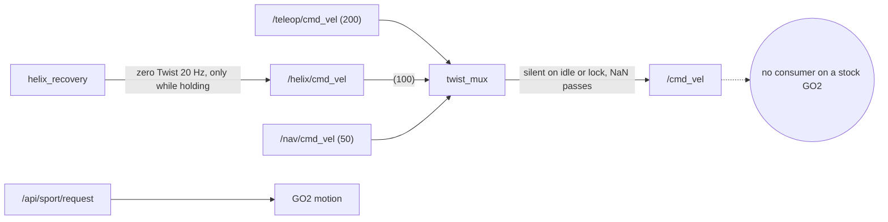
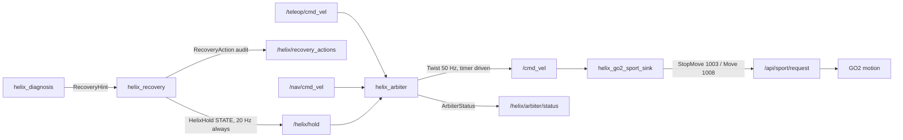

# Motion arbitration: how a HELIX STOP reaches the motors

Status (2026-09-17): closed **in software, off-robot**. Physical stopping on
the GO2 is **not yet proven**; it becomes proven only when stage E of
[`HW_MOTION_TEST.md`](HW_MOTION_TEST.md) passes on the robot.

## The gap this closes

In Session 8, HELIX detected faults, diagnosed them, and published 3,064
zero-twist commands on `/helix/cmd_vel`, which had **zero subscribers**. The
intended downstream was `twist_mux`. An audit of that path found it could not
have stopped the robot even if it had been wired:

| # | Finding | Evidence |
|---|---|---|
| 1 | A stock GO2 has **no `/cmd_vel` consumer**. Motion is commanded through `unitree_api/msg/Request` on `/api/sport/request` (StopMove 1003, Move 1008). | `GO2_FIELD_NOTES.md` sections 3 and 4 |
| 2 | `twist_mux` goes **silent** when every input is stale. It does not publish zero, although the repo's YAML and model said it did. The consumer keeps its last command. | twist_mux 4.3.0 source (publishes only from an input callback) and a probe against the real binary: 0 messages in 1.5 s after all inputs stopped |
| 3 | A `twist_mux` lock **silences** the output. It does not publish zero. | Same probe: 0 messages while locked with `/nav/cmd_vel` streaming 0.3 m/s |
| 4 | `twist_mux` forwards **NaN**. | Same probe: 8 NaN twists forwarded |
| 5 | HELIX at priority 100 sits below teleop at 200, so a live joystick stream **defeats** a STOP_AND_HOLD. | `config/twist_mux.yaml` |
| 6 | A zero-twist velocity input is itself a **second motion authority** competing in the mux. | design |
| 7 | The recovery cooldown (5 s) outlived the diagnosis clear window (3 s). A fault that recurred after a RESUME and inside the cooldown was `SUPPRESSED_COOLDOWN`, so the robot kept moving with a live fault. | reproduced as a regression test, now fixed |

## Architecture before

In Session 8 even `twist_mux` was absent: `/helix/cmd_vel` had no subscriber.

## Architecture after

The **authoritative motion path** is
`upstream source -> helix_arbiter -> /cmd_vel -> helix_go2_sport_sink -> /api/sport/request`.
`helix_arbiter` is the only publisher of `/cmd_vel`, and the sink is the only
HELIX-side publisher of `/api/sport/request`. HELIX recovery publishes no
velocity at all. Preflight checks C5, C6, C8 and C13 enforce these facts on
the live graph.

## Arbitration policy (`helix_arbiter/arbiter_core.py`)

| | Condition | Output |
|---|---|---|
| P1 | HELIX hold asserted | zero, whatever any source's priority |
| P2 | no HELIX state ever received | zero (`HELIX_STATE_MISSING`) |
| P3 | HELIX state older than `hold_timeout_sec` (0.5 s) | zero (`HELIX_STATE_STALE`). A dead or partitioned recovery node stops the robot. There is deliberately no "release on stale" option. |
| P4 | NaN, Inf, or over-limit input | rejected; that source's previous command is also discarded, so an older good value is never reused |
| P5 | source older than its timeout (0.5 s) | dropped from arbitration |
| P6 | released, no valid fresh source | zero (`NO_LIVE_INPUT`) |
| P7 | any hold transition (assert, release, stale) | every stored source command is discarded, so after a RESUME a source must publish a **new** command before anything moves |
| P8 | HELIX state out of order | ordered by (epoch, seq); older or duplicate states are dropped while the current state is fresh. Once stale, any epoch is accepted, so a restarted recovery with a stepped clock can recover. |
| P9 | axes | only linear.x, linear.y, angular.z pass; the other three must be finite and are zeroed |
| P10 | clocks | freshness uses the arbiter's monotonic receipt clock only; publisher stamps are for tracing (robot and payload clocks are skewed) |

Output is published on a 50 Hz timer, so silence is never ambiguous. On
SIGINT, SIGTERM or lifecycle deactivate, the arbiter publishes 10 zero
commands and then goes silent. rclpy's default handlers shut the context
down before user code runs, so the arbiter and sink install their own.
SIGKILL or power loss cannot be handled by any process; the sink's deadman
covers that case (StopMove after 0.25 s without an arbiter message).

**RESUME never creates motion.** It clears the hold state. Under P7 the arbiter
then outputs zero until an upstream source publishes a new command.

**Operator override.** No software source can override a HELIX hold. To move
the robot with HELIX holding, deactivate `helix_recovery_node`. The arbiter
then treats the state as stale and **still** holds zero until recovery is
reactivated. The physical remote and the lab e-stop remain outside this path.

## Sink (`helix_go2_sport_sink`)

Its only input is the arbiter output. Its mode is fixed at startup:
`dry_run` makes the armed decisions but sends nothing, `stop_only` can only
send StopMove, and `armed` may send Move within its own limits (0.25 m/s,
0.20 m/s, 0.50 rad/s). Over-limit or non-finite input produces StopMove, never
a clamped Move. Api id 1001 on this topic is Damp, which drops the robot; the
sink refuses every id except 1003 and 1008. While the command is zero it
repeats StopMove at 2 Hz, which fights the handheld remote's locomotion.

## Off-robot verification

All numbers below come from real processes over real DDS on one
workstation. No robot was involved.

### Integration harness: 20 required scenarios

`src/helix_arbiter/test/test_arbiter_integration.py` runs the real arbiter,
recovery, diagnosis and sink processes, with fake upstream sources and a fake
final consumer. It passed 19/19 test cases on 6 consecutive runs (114/114) after a bug in the test itself (not the arbiter) was fixed.
Cases 02 and 03 share one test, and SIGINT/SIGTERM are one parametrized test.

| # | Scenario | Result |
|---|---|---|
| 01 | normal command passes when HELIX healthy | output = nav command |
| 02, 03 | STOP forces zero and persists with teleop and nav still streaming | >100 consecutive zero outputs over 2.5 s |
| 04 | RESUME releases without creating motion | zero until a new nav message arrives |
| 05 | repeated STOP | first ACCEPTED, rest SUPPRESSED_COOLDOWN, output zero throughout |
| 06 | repeated RESUME | zero, then normal on a new command |
| 07 | RESUME without STOP | no effect on a moving command |
| 08 | STOP after RESUME inside the cooldown | ACCEPTED (defect 7 regression) |
| 09 | recovery SIGKILLed | zero in 475 ms median, 485 ms max (n=5) |
| 10 | upstream source dies | zero in 495 ms median, 500 ms max (n=5) |
| 11 | final consumer disappears and returns | arbiter keeps running; status reports 0 sink subscribers; rejoining consumer sees only zeros while held |
| 12 | HELIX state never arrives | zero, `HELIX_STATE_MISSING` |
| 13 | reordered RESUME and delayed hold state | reordered RESUME dropped; a delay longer than 0.5 s forces zero |
| 14 | NaN, +Inf, -Inf on linear and angular | 0 non-finite outputs; earlier good value not reused |
| 15 | SIGINT | clean exit 0, last outputs are a zero burst |
| 16 | SIGTERM | same |
| 17 | arbiter lifecycle deactivate and reactivate; recovery deactivate | inactive arbiter emits no motion; reactivation requires a fresh command; recovery deactivate forces zero at once |
| 18 | fault while command is zero | hold asserted, output stays zero |
| 19 | fault while moving, full chain including sink | complete chain; sink StopMove caused by the zero |
| 20 | two sources | priority respected; STOP overrides both |

Pure policy tests cover the same ground at the logic level (arbiter core,
sink, preflight, stage gating, trace analysis).

### Stage latency (trace)

Each stage is timed with the wall-clock stamp that its publisher writes into
the message. HELIX, the arbiter and the sink share one host (the payload
Jetson on the robot), so the differences between stamps are the pipeline
latency. Observer receipt times only show ordering, because a
single-threaded observer drains its queue in batches.

**Session 8 replay** ([`results/session8_arbiter_replay.json`](../results/session8_arbiter_replay.json),
raw trace `results/session8_arbiter_replay.trace.jsonl.gz`). The 30 **real**
FaultEvents recorded on the GO2 in Session 8 were replayed through the real
diagnosis, recovery, arbiter and sink (dry_run), with a fake nav source
streaming 0.2 m/s:

- 14 hints and 14 actions, the same counts Session 8 recorded. The only
  status differences: three RESUMEs that Session 8's older code suppressed by
  cooldown are now accepted (an earlier fix). Session 8's 148 s stuck hold
  becomes 3.1 s holds.
- 5 accepted STOPs; all 5 chains complete from fault to zero output.
- fault to zero output: median **1.0 ms**, max 8.4 ms (n=5); fault to sink
  StopMove decision: median **1.1 ms**, max 8.5 ms.
- **0** nonzero outputs during any hold; 0 non-finite outputs in 5,108.
- Idle gaps over 10 s were shortened to 10 s. Every decision-relevant
  interval is shorter than that (3 s clear window, 5 s cooldown, 0.5 s
  timeouts), and the result file lists each gap.

The first STOP a recovery process handles costs about 8 to 9 ms between
action and hold; every later STOP costs about 0.5 ms. The consistent
position points to first-use initialization in the recovery node. This is
not investigated further.

**A-F rehearsal** ([`results/hw_rehearsal_summary.json`](../results/hw_rehearsal_summary.json)):
`scripts/hw_rehearsal.sh` ran the exact hardware procedure against
`helix_fake_go2`, which speaks the real `unitree_api` Request and Response
types. All six stages passed on a clean tree at the recorded SHA. Stop time
and distance in that file describe the fake robot's first-order lag model
and **say nothing about the GO2**.

## What only hardware can answer

1. The GO2 accepts StopMove and Move **from this sink**. The field notes
   verified the header format with hand-rolled requests; this node has never
   published to a robot. Stage B checks this (response code 0).
2. Physical stop time and distance from 0.15 m/s after StopMove. The field
   notes record this as NOT MEASURED. Stage E measures it.
3. Whether a stock publisher among the nine on `/api/sport/request` commands
   motion during the test. The stage-A baseline catches new publishers, not
   activity from existing ones.
4. Pipeline latency on the Jetson under real load. The ~1 ms figures come
   from a workstation.
5. Whether `/utlidar/robot_odom` pose differences track body speed well
   enough to call "stopped" at 0.03 m/s.
6. Whether `/utlidar/robot_odom` publishes with motors off (stage A treats
   staleness as WARN).
7. Real HELIX false positives during a stage. An idle GO2 has produced
   spurious anomalies before. A stage that starts inside a hold is NO-GO
   (C11b), and an uninjected STOP during a stage fails it as confounded.
8. Whether a sport lease (`/api/sport_lease`) held by another client
   rejects requests sent with lease id 0.
